#  
 Microsoft Teams Clone 

###  
[Click Here to Access The App](https://micorosoft-teams-clone.herokuapp.com/)

## Table Of Contents

1. User Guide
2. Technology Stack
3. Agile Methodology
4. Testing
5. Epics-Features-Stories
6. Database Diagram

##  A Comprehensive User Guide

  

&nbsp;  &nbsp;&nbsp;&nbsp;&nbsp;&nbsp;&nbsp;&nbsp;&nbsp;&nbsp;&nbsp;&nbsp;&nbsp;&nbsp;&nbsp;&nbsp;&nbsp;&nbsp;&nbsp;&nbsp;&nbsp;&nbsp;&nbsp;&nbsp;&nbsp;&nbsp;&nbsp;&nbsp;&nbsp;&nbsp;&nbsp;&nbsp;&nbsp;&nbsp;&nbsp;&nbsp;&nbsp;&nbsp;&nbsp;&nbsp;&nbsp;&nbsp;&nbsp;&nbsp;&nbsp;&nbsp;&nbsp;&nbsp;&nbsp;\-Manasvi Vaidyula

  

####  Introduction

This web application was built to emulate the Microsoft teams Application that is so widely known and used. This endeavour was a part of the Microsoft Engage Mentorship Program '21 and it contains a multitude of features that are inorporated in the Microsoft Teams application. This article serves the purpose of providing an end-to-end guide for any new users navigating the application as well as listing out all the features and functionality that this application has to offer.

####  Sign Up and Login

As a user, you have the option to Login if you have an account, or create a completely new account.

**Log in**
The login page will simply ask for your registered username and email and assuming the entered values are correct, it will sign you in to your account and you are ready to begin browsing teams!

**Sign Up**
The sign up page will prompt you to enter your name along with the email and password that you would like to register and once that is entered and submitted, you can immediately login!
 
 

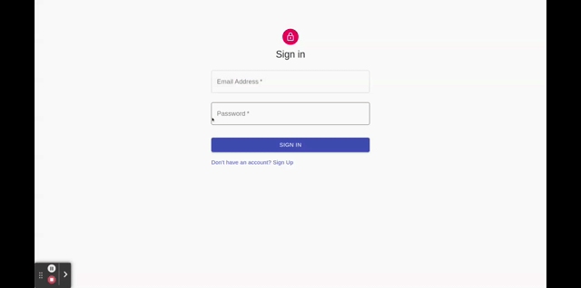  
  &nbsp;&nbsp;&nbsp;&nbsp;&nbsp;
  &nbsp;&nbsp;&nbsp;&nbsp;&nbsp;
  &nbsp;&nbsp;&nbsp;&nbsp;&nbsp;
  &nbsp;&nbsp;&nbsp;&nbsp;&nbsp;
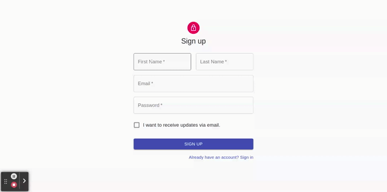  

  

###  Teams Page

`Teams` are like virtual groups of people that share access to many things such as conversations and video meets that take place among the members of that Team. A single user can be a member of as many teams as they wish and each Team can have different members, relevant conversations, and Video Meets.

  

Once you are logged in, you will be directed to the Teams page where you will find a list of all the Teams that you are a member of. You can view any of the Teams simply by clicking on the card.

  

Here you also have the opportunity to create a new Team by clicking the button in the top right corner. You will be asked to input a name for the Team, as well as a general description of what the purpose of this Team is. Once that is done, the new Team will be created and will now appear on the Teams page.

 
 

  

 
 

  

Entering a Team will immediately put you on the `General Channel` of that Team. Let's take a look at what 'Channel' actually means.

  

###  Channels

`Channels` act as a kind of sub-class of a Team. They can be used to subdivide the Team by topic into smaller groups of discussion and collaboration. It is also extremely easy to create new channels, and it's as easy as just clicking a button. This allows for much more organization and flexibility within a Team as well as effective communication among its members.

  

Each Channel Page has a lot going on, so let's break it down one by one.

-  The text on the top left of the Navigation Bar specifies which Channel you are currently on

-  Opening the side bar on the top left gives you access to a variety of things:

-  The first is an option to go back to the inital Teams page so that you can quickly and easily move between teams.

-  The next little box gives a brief introduction to what the purpose of the Team is. This was set when the Team was initially created.

-  Below that is a list of all the channels that are present in this Team. You can navigate to any of the channels and its respective page with a single click.

-  Here you also have the option to create an entirely new channel. If you click this button, you will get a pop-up box prompting you to enter a name for the channel. Once this is done, your channel is created and you can view it and navigate to it from the side bar.

 
 

  

 
 

-  And finally there is an option to leave the Team.

-  At the bottom of the screen is an option to start a new `Conversation`. Conversations will be discussed in the next section, but briefly, Conversations are channel-specific chat pages that allow users to communicate through text messages.

On clicking the Create New Conversation button, you will be prompted to enter a topic for the conversation and then a new conversation is created! All the existing conversations of a particular channel will be displayed in that channel itself and are not accessible from other channels.
 
 

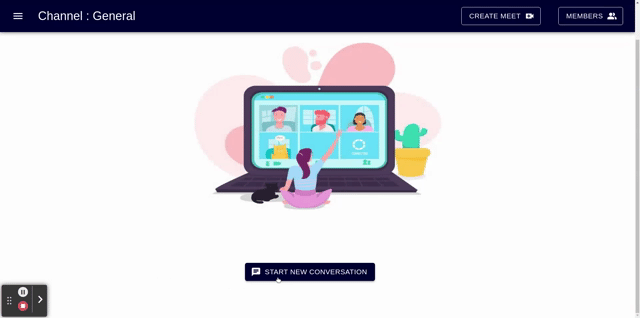  

 
 

-  At the top right there is an option to start a `Meet`. Meets will also be discussed in future sections, but essentially, they are channel-specific video calls that multiple members can join and participate in live discussions with other Team members that have joined the Meet.

Meets can be started by clicking on the Create Meet button and entering the topic of the meeting. There can only be one Meet per channel at a time, and if a Meet is running, the Create Meet button will change to a Join Meet button which you can click on the join the ongoing Meet. Note that any text conversations that go on in a Meet will also be stored as a Conversation in the corresponding Channel page.
 
 

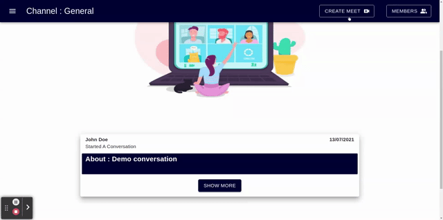  

 
 

-  The last button on the top right is the Members button. This can be used to view the current members in the Team as well as add more by entering an email and clicking on the **+** sign in the prompt.
 
 

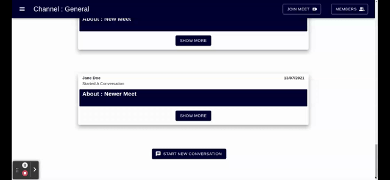  

 
  

###  Conversations

`Conversations` are seperate chat pages where users can carry out text conversations that anyone in the channel can participate in! Messages can be sent by typing out your message in the text field at the bottom of the page. To send the message, simply click on the arrow button on the right and voila! Your message has been sent and can now be seen in real time by anybody else viewing the chat.

Any messages that are sent by you will be visible on the right side of the page in a Purple color and messages sent by others will appear on the left in Green

All messages consist of three blocks:

-  The top row that shows the name of the user who sent it on the left, and the date of sending on the right

-  The middle chunck shows the actual message that was sent.

-  The bottom row shows the time of sending on the left.
 
 

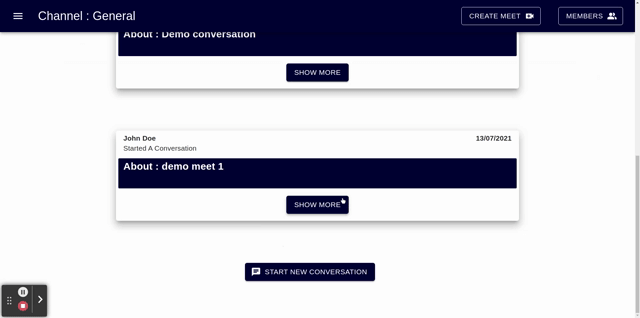  

 
  
  

The top of the Conversations page shows the topic of the conversation that was entered when it was first created. On the top left you also have a button to take you back to the main channels page.

  

###  Meet

`Meets` can be created from the channels page and are channel specific. This means that any Meet that is created belongs to a particular channel and can only be accessed through that channel. Clicking on the Create Meet button instantiates a Meet.

But what exactly is a Meet? It's nothing but a video call that up to 6 people can join and interact on in real time! On the Meet page, there a multitude of features, but the most striking is how videos of all the participants are visible and how each of them are clearly audible. Users are also notified every time a new member joins the Meet. In the case that 6 members are already present in the Meet and another user tries to join, the user will be prompted that the Meet is full and will not be allowed to access the Meet.

There are 6 buttons visible on the top of this page:

-  The first two are options to Mute Audio and Stop Video Feed respectively. They do exactly as their names imply and can be used to prevent the other participants from hearing your audio or seeing your video.

-  The next button is the chat button. Clicking on this opens up a small pop-up where you can send text messages to other users present on this Meet. This chat window can be thought of as a simple version of a Conversation page. This chat gets saved and when the Meet ends, it becomes a Conversation that Team members can continue even after the Meet finishes!

-  The next button opens up a new window with a shared `Whiteboard` that users in the Meet can draw on. Here, you can change the color of the drawing brush as well as change the thickness of the brush.

When a user makes a change to the Whiteboard, it updates on other users Whiteboard screens in real time, allowing for streamlined and effective collaboration, even through drawing and diagrams! The whiteboard remains functional and can be used even after the Meet ends.

 
 

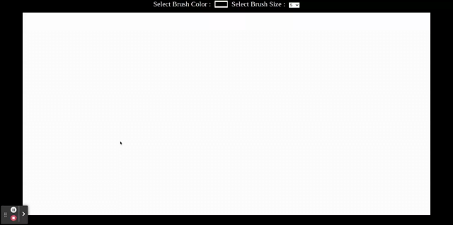  

 
  

-  The second to last button is a screen share button that allows you to share either a window, tab, or your entire screen. On clicking this button, you will be prompted to choose among them and then your screen will be shared based on that. Now, all the other participants can see exactly what's going on in your screen in real time! To stop the screen share, simply click on the prompt provided by your browser.

-  The final button allows you to leave the Meet and go back to the Channel page. The Meet remains active until all members have left the call, at which point it automatically closes and saves the chat as a Conversation.

##  Technology Stack

### Frontend
**React** was chosen as the choice of  framework due to its convenient development environment. In react the virtual DOM doesn't regenerate the entire page. This means that I can optimize the update process and create standalone virtual representations with an updated fragment. It'll then be reconciled with the actual DOM, but only an edited portion of the codebase will be processed on the server.

For the design and components of the app **Material UI** was primarily used, which allowed for faster and easier stylized web development.

### Backend

**Express(.js)** - A Node.js web framework was used for the backend. Simplicity, minimalism, flexibility, scalability are some of its characteristics and since it is made in **NodeJS** itself, it inherited its performance as well.

For the database **MongoDB Atlas** was used due to its flexibility ( from saving unstructured data in JSON format ) and speed of document retrieval.

### Video Call and Real Time Communication

With the help of  **PeerJS** a **WebRTC** ( Web Real-time Communications )  wrapper I was able to facilitate **peer-to-peer** audio, video, and data communication without using any plugin. Another huge advantage was its lowest-latency streaming technology which achieves an almost instantaneous stream.

To achieve group video call, a WebRTC P2P mesh architecture was adopted, wherein every WebRTC client has a peer connection opened to all other clients directly. 
Some of the huge advantages of using this architecture are:
1. **It is inexpensive to operate**, since there are no media servers, the media flows directly between the users.
2. **It maintains privacy**.

However the major disadvantage of the mesh network is that it brings a lot of challenges and strain when it comes to bandwidth and CPU requirements. Due to this reason, I limited the number of particpants in a group call to a maximum of 6.

**Socket**.**io** library was used to establish a connection between two devices with WebSockets.
WebSocket is a communication protocol which provides a full-duplex and low-latency channel between the server and the browser. With the help of this library I was able to imeplement a **real time chat** and **shared whiteboard collaboration** system on the app. The [rooms feature](https://socket.io/docs/v3/rooms/index.html) in socketio enabled me to implement the **chat rooms** and **meet rooms** features as well.

## Agile Methodolgy

### Sprint Planning 

At the start of every week I planned out the features and goals I had to implement. I would typically spend the first 4-5 days of the week in actually implementing each feature. After implementing the features I had done intensive testing on all the features and tested it on variuos browsers as well.

At the end of every week i would work on the documentation and planning of the next week.

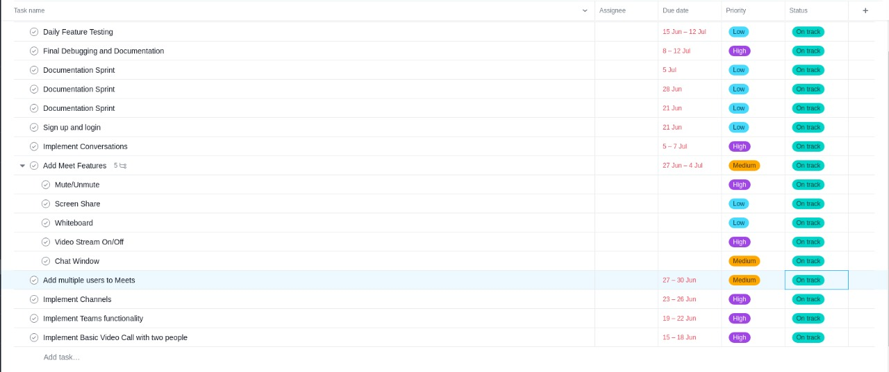  

 
 

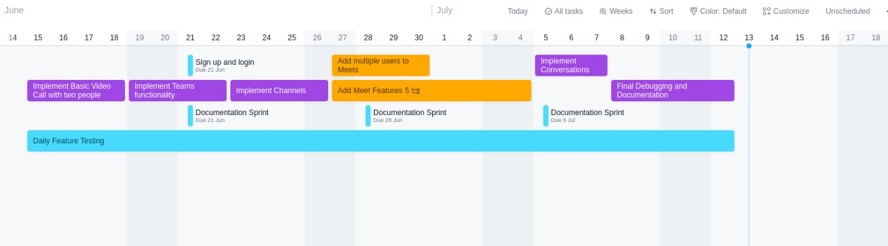  

## Testing

#### Feature : User Registeration

| Scenario  | Outcome |
|--|--|
| User enters invalid email | Account not successfully created   At the moment the app just checks for the presence of the "@" symbol in the entered email|
|User does not enter password | Account not successfully created|
|User does not enter first Name/ last Name | Account not successfully created|
| User enters email which already exists in database | Account not successfully created, user is requested to register with different email

#### Feature : User Login
|Scenario  | Outcome |
|--|--|
|User enters unregisterd email  | Further access denied, error prompt displayed |
|User enters incorrect password | Further access denied, error prompt displayed |

#### Feature :  View all Teams user is a member of 

| Scenario |  Outcome|
|--|--|
| User can view all the teams he/she created | Yes |
| User can navigate to any team he/she wants to | Yes |
| User can view all teams he/she was added to | Yes |

#### Feature :  Create a new Team
| Scenario |  Outcome|
|--|--|
| User tries to create team with no name | Team not successfully created |
| On creating new team , general default channel gets created| Yes |
| On creating new team user can navigate to it | Yes |

#### Feature :  Adding new user to a team

| Scenario | Outcome |
| -- | --|
| User enters non registered email while trying to add member | User not successfully added, error prompt displayed |
|User tries to add member who already exists in team | User not added again , Error displayed|  

#### Feature :  Creating New Channels in the team

| Scenario |  Outcome|
|--|--|
| User tries to create channel with no name | Channel not successfully created |
| Default General Channel exists in every team | Yes|
| All members in the team can access all channels in the team | Yes|
| Any User who is a member of the team can create a new channel | Yes|

#### Feature : Channels in a team

| Scenario | Outcome |
|--|--|
| User can access all previous conversations that took place in a channel | Yes |
| At max only 1 meet can take place in a channel | Yes |
| If a meet is going on in a channel, any user in the team has access to the meet | Yes |
| User can create new conversation | Yes |
| User can create new meet ( if no meet is already going on) | Yes |

#### Feature :  Conversation Room

| Scenario |  Outcome|
|--|--|
| Users can have a real time chat in a conversation room | Yes|
| User can view all the messages in a conversation room | Yes|
| User can send new message in a conversation room | Yes|

#### Feature :  Video Meet 
|Scenario  | Outcome |
|--|--|
| User's media devices ( audio/video ) are inaccessible | User cannot join meet  **Note:** In firefox web browser, ensure that camera is not being used on any other tab/browser while trying to join the meet|
|  User tries to join ongoing meet and room is full (6 users)  | User cannot join meet |
|User mutes | Other users cannot hear the user |
|User switches camera off | Other users cannot see the user |
|Users in the meet can have real time chat | Yes |
| All messages in the meet can be accessed after meet ends | Yes |
| All users can edit together while on meet using a shared whiteboard in real time|  Yes|
| Users can continue using whiteboard after meet |  Yes|
| Users can share screen |  Yes,   **Note :** For chrome web browser user can share window and a tab as well|
| Meet ends after all users leave the meet | Yes | 

#### Feature : WhiteBoard 
| Scenario |  Outcome |
|--|--|
| Users can change their brush size/ color while using a whiteboard | Yes |
| Real time collaboration with multiple users | Yes |

## Epics - Features - Stories Diagram

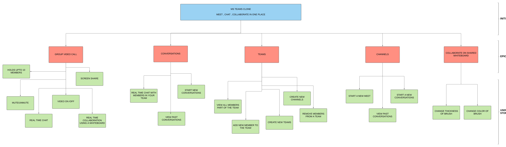  

 
 

## Database Schema Diagram

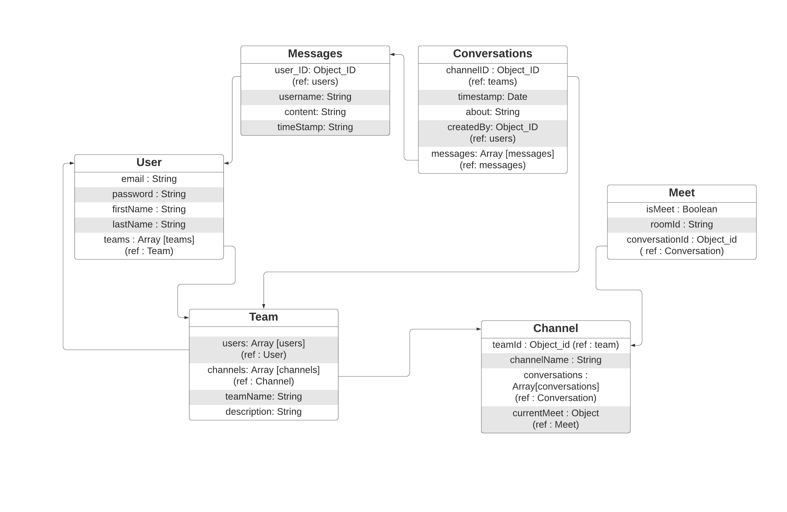  

 
 

